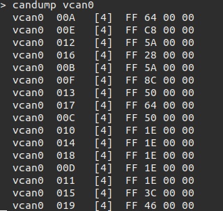

# CanbusController
## Hardwares
1. Raspberry Pi
2. Cando USB To CAN Module 

## Installation
``` bash
pip3 install -r requirements.txt
```

## UDP Testing with virtual CAN network (Linux only)
1. Create a virtual can interface using SocketCAN run the following:
    ``` bash
    sudo modprobe vcan
    # Create a vcan network interface with a specific name(vcan0)
    sudo ip link add dev vcan0 type vcan
    sudo ip link set vcan0 up
    ```
2. Running `UdpServer2CANbus.py` 
    ``` bash
    ./UdpServer2CANbus.py -c vcan0
    ```
3. Print all data that is being received by a CAN interface.
    ``` bash
    candump vcan0
    ```
4. Running `Json2UdpClient.py` to send a UDP data.
    ``` bash
    cd test
    ./Json2UdpClient.py
    ```
    As result, the output of terminal at step 3 shows: 

    
    ### Record CAN bus data on `vcan0`
    ``` bash
    candump -L vcan0 > can.log
    ```
    ### Play recorded CAN bus data on `vcan0`
    ``` bash
    canplayer vcan0=vcan0 -I can.log
    ```