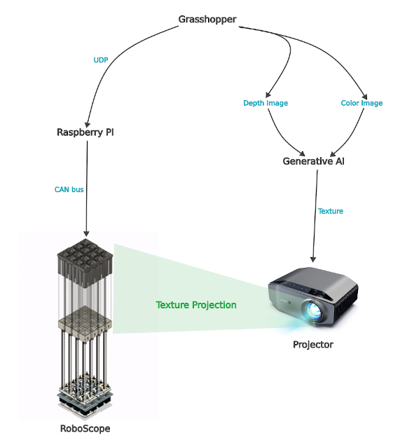
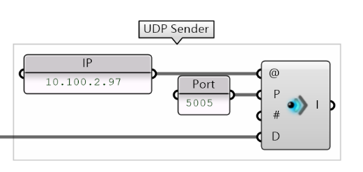
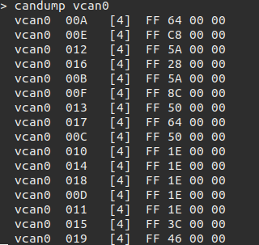

# RoboScope
## System Diagram

## Network Configuration
### Method 1 - Connect through a Router 
- Both Grasshopper computer and Raspberry Pi connect to a router.
- Check IP address of the Raspberry Pi.
### Method 2 - Connect through Ethernet cable  
- Connect Grasshopper computer and Raspberry Pi via a Ethernet cable directly and follow the cofiguration below to set up a network:
  | Device |   IP  |  Mask | Gateway |
  |  ---   |  ---  |  ---  |   ---   |
  | Grasshopper computer | 192.168.0.2 | 255.255.255.0| 0.0.0.0|
  | Raspberry Pi | 192.168.0.1 | 255.255.255.0 | 0.0.0.0 |
## Rhino Grasshopper
### Install Plugin
1. Networking plugin: `gHowl` can be downloaded from [here](https://www.food4rhino.com/en/app/ghowl). And check [this instruction](https://www.food4rhino.com/en/faq#users-install-grasshopper-plugin) to install the plugin.

### Set up Raspberry Pi IP address on Grasshopper
Here we assume that Raspberry Pi is hosted at `10.100.2.97`



## CanbusController (run at Raspberry Pi)
### Installation
``` bash
sudo apt-get install can-utils
cd CanbusController
pip3 install -r requirements.txt
```
### Quick Start
1. Plug in CANDO and start interface.
    ``` bash
    sudo ip link set can0 up type can bitrate 1000000
    ```
2. Start `UdpServer2CANbus.py` service.
    
    Here, we assume the ip of Raspberry Pi is `192.168.0.1`, and the ip address of Grasshopper computer is `192.168.0.2`
    ``` bash
    ./UdpServer2CANbus.py -i 192.168.0.1 -p 5005 -gi 192.168.0.2 -gp 5005 -c can0
    ```
3. You can see CAN bus raw data by:
    ``` bash
    candump can0
    ```
4. Drag slider bars (in Grasshopper) then you will see something similar to this:

    

## [TEST] Send JSON to Grasshopper through UDP
We assume the ip address of Grasshopper computer is `192.168.0.2`.
``` bash
cd CanbusController/test
./Json2UdpClient.py -i 192.168.0.2 -f grasshopper_output.json
```
## [TEST] Send Recorded CAN bus Data to Grasshopper through UDP
1. Start service
    ``` bash
    cd CanbusController
    ./Json2UdpClient.py -i 192.168.0.2 -f grasshopper_output.json -c vcan0
    ```
2. Play recorded CAN bus data on `vcan0`.
    ``` bash
    cd CanbusController/test
    canplayer vcan0=vcan0 -I can.log
    ```
